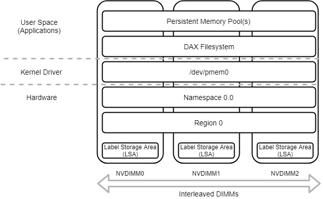
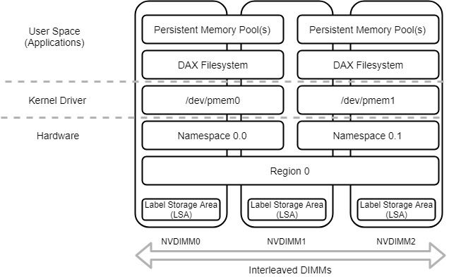
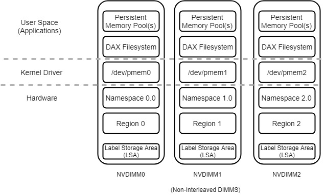

# Concepts

## Persistent Memory Concepts

This section describes the basic concepts when configuring and managing NVDIMMs. The following describes terms used throughout this chapter.

**Interleaved Sets:** two or more NVDIMMs create an N-Way interleave set to provide stripes read/write operations for increased throughput. Commonly 2-Way or 4-Way interleaving.

**Region:** a grouping of one or more NVDIMMs, or an interleaved set, that can be divided up into one or more Namespaces. Regions are created within interleaved sets.

**Label Storage Area \(LSA\):** Namespaces are defined by Labels which are stored in the Label Storage Area\(s\)

**Namespace:** defines a contiguously-addressed range of Non-Volatile Memory conceptually similar to a hard disk partition, SCSI Logical Unit \(LUN\), or an NVM Express namespace. It is the unit of persistent memory storage that appears in /dev as a device usable for I/O.

**Type:** defines the way in which the persistent memory associated with a Namespace or Region can be accessed. Valid Types are PMEM and BLK

* **PMEM:** Direct access to the media via load/store operations. DAX Supported.
* **BLK:** Direct access to the media via Apertures \(sliding memory windows\). DAX is not supported.

**Mode:** defines which NVDIMM software features are enabled for a given Namespace. Namespace Modes include raw, sector, fsdax\(memory\), and devdax\(dax\). Sibling Namespaces of the same parent Region will always have the same Type, but might be configured to have different Modes.

## Configuration Options

This section discusses some of the common configuration options but does not cover all possible supported config.

Using one or more physical NVDIMMs, the available capacity can be configure in many different ways. Figure 1 below shows a typical Filesystem-DAX \(FSDAX\) configuration with three physical NVDIMMs that have been interleaved. All available capacity has been used to create a single region \(Region0\), namespace \(Namespace0.0\), and dax enabled filesystem created. Namespace naming convention is commonly X.Y where X is the region number and Y is the namespace. The persistent memory pool\(s\) are memory mapped to the application, thus allowing direct load/store access to the NVDIMMs.

Figure 2 shows a configuration where the region has been partitioned into two namespaces. Each namespace has a single DAX Filesystem.

Figure 3 shows a configuration where NVDIMM interleaving has been disabled. In this mode, each NVDIMM becomes addressable with single regions per device. Regions and Namespaces cannot be striped or interleaved across NVDIMMs. It is possible to use software RAID such as Linux's Device Mapper to implement mirroring, striping, or concatenation of the /dev/pmem{N} devices.

The following sections describe each layer in more detail.

